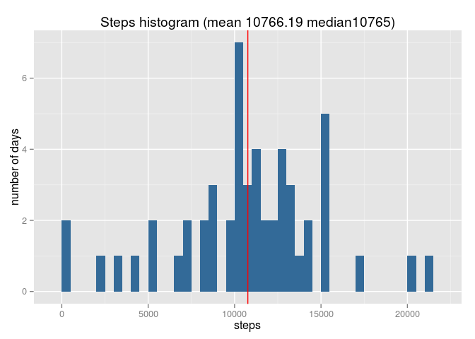
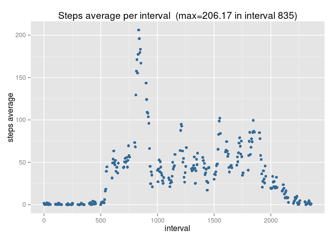
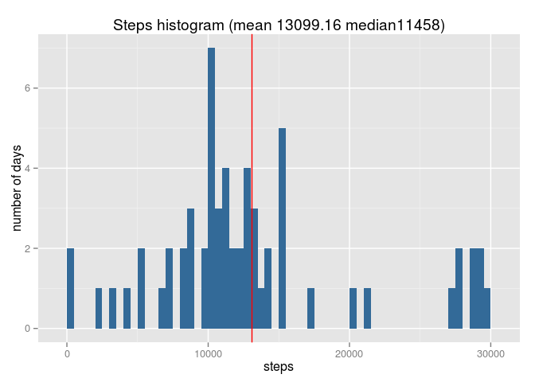
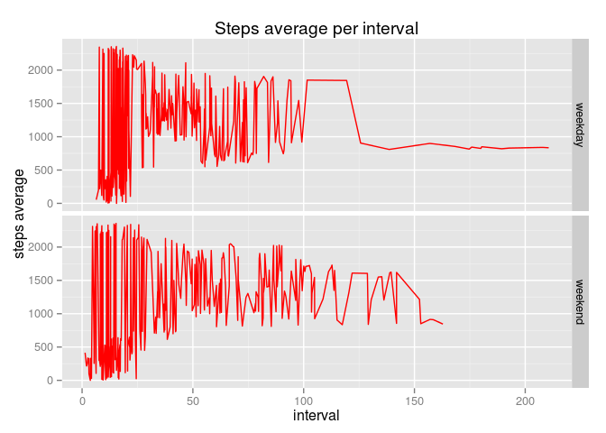

# Reproducible Research: Peer Assessment 1

## Loading and preprocessing the data
We need ggplot2 and plyr packages.

```
## Loading required package: ggplot2
## Loading required package: plyr
```
Dataset file is in csv format, so we read it using read.csv function.

```r
activity<-read.csv("activity.csv") #(steps, interval, date)
```
Now dataset alternative aggregations by date and by interval.

```r
actAgg<-aggregate(.~date,data=activity,sum); #by date aggregation
sMean<-mean(actAgg$steps); sMedian<-median(actAgg$steps)
actIntAgg<-aggregate(.~interval,data=activity,mean); #by interval
actIntAgg<-arrange(actIntAgg,interval)
maximum<-max(actIntAgg$steps)
maximumInterval<-actIntAgg[actIntAgg$steps==maximum,]$interval[[1]]
```
Now we fill NAs in an alternative dataset and we also aggregate by date

```r
#activity dataset filling NA values
activityFilled<-arrange(activity,date)
isNA<-is.na(activityFilled$steps); nNAs<-table(isNA)[2] #NAs counting
actFilledAgg<-aggregate(.~date,data=activityFilled,sum)
actFilledAgg<-arrange(actFilledAgg,date)
i<-1;j<-1 #we use steps average per date instead of NA
k<-0 #filled rows
nAgregats<-dim(actFilledAgg)[1]; nRegistres<-dim(activityFilled)[1]
set.seed(.5)
defaultSteps<-.25*(range(activityFilled$steps[
                                        !is.na(activityFilled$steps)]
                                 )[2])
while ((j<=nAgregats)&(i<=nRegistres)) {
        if(is.na(activityFilled[i,]$steps)) {
                activityFilled[i,]$steps<-defaultSteps*runif(1)[1]
                k<-k+1
        }
        i<-i+1
} 
actAggF<-aggregate(.~date,data=activityFilled,sum) #aggregating filled ds
sMeanF<-mean(actAggF$steps); sMedianF<-median(actAggF$steps)
```
New factor variable dayType with two levels.

```r
activityFilled<- mutate(activityFilled,
                        weekday=weekdays(as.Date(date)),
                        dayType=as.factor(ifelse((weekday=="dissabte")|
                                             (weekday=="diumenge"),
                                             "weekend","weekday"))
                        ) #new factor var dayType
```
And finally, in terms of preprocessing actions, we aggregate filled dataset by dayType and interval.

```r
actFilledIntDtAgg<-aggregate(steps~dayType+interval,
                             data=subset(activityFilled,
                                         select=c(steps,interval,dayType)),
                             mean); 
actFilledIntDtAgg<-arrange(actFilledIntDtAgg,interval)
```

All data is already prepared for plotting.

## What is mean total number of steps taken per day?
Next histogram shows steps bars, mean and median.

```r
g<-qplot(steps,
      data=actAgg,
      ylab="number of days",title="Steps histogram",
      binwidth=500,fill=2)
g+ geom_vline(aes(xintercept=sMean),color=2)+
   labs(title=paste0("Steps histogram (mean ",round(sMean,2), 
                     " median", sMedian,")"))+
   theme(legend.position="none")
```

 

## What is the average daily activity pattern?
Pattern can be shown plotting average steps by interval.

```r
g<-qplot(interval,steps,
      data=actIntAgg,color=6)
g+ labs(x="interval")+
   labs(y="steps average")+
   labs(title=paste0(
           "Steps average per interval ",
           " (max=", round(maximum,2),
           " in interval ", maximumInterval,")")
        )+
   theme(legend.position="none")		
```

 

Activity unrises dramatically in night, obviously. Morning activity higher.

## Imputing missing values
Previously we calculated NAs.
You can appreciate the effect of filling NAs in next histogram.

```r
paste0("Total rows with NAs: ",nNAs,".")
```

```
## [1] "Total rows with NAs: 2304."
```

```r
g<-qplot(steps,
      data=actAggF,
      ylab="number of days",
      title="Steps histogram (filled df)",
      binwidth=500,fill=1
      )
g+geom_vline(aes(xintercept=sMeanF),color=2)+
  labs(title=paste0("Steps histogram (",
                    "mean ",round(sMeanF,2), 
                    " median", sMedianF,")"))+
  theme(legend.position="none")
```

 

Missing data were clearly impacting in mean and median calculations. 
Mean and median calculated and written on previous histograms confirm this afirmation.

## Are there differences in activity patterns between weekdays and weekends?

Now we plot average steps per interval on weekends and on weekdays.

```r
g<-ggplot(actFilledIntDtAgg,aes(steps,interval))
g+ geom_line(color=2)+
   facet_grid(dayType~.)+
   labs(x="interval",y="steps average")+
   labs(title="Steps average per interval")
```

 

There are some differences between weekdays and weekends. Basically more activity in the morning of weekdays and perhaps higher activity levels later in weekends. 
